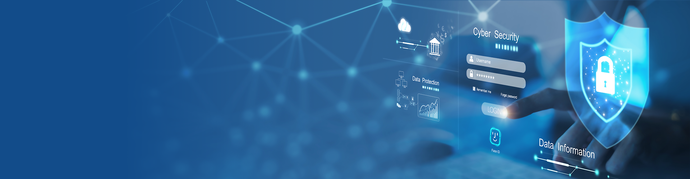

# 👨‍💻 Welcome to My Cyber Lair

## 🧠 About Me
Hey there! I'm a passionate cybersecurity enthusiast, researcher, and builder of digital fortresses. From breaking into machines (ethically!) to building tools that defend them, I live at the intersection of offensive and defensive security.

- 🔐 Focus Areas: Penetration Testing, Vulnerability Management, Network Security, Threat Intelligence
- 🛠️ Tools of the Trade: Metasploit, Burp Suite, Nessus, Nmap, Wireshark, Snort, Splunk
- 💻 Languages: Python, Bash, PowerShell, SQL

## 🎯 My Mission
> To make the digital world a safer place by empowering others, exposing vulnerabilities, and defending against the ever-evolving threat landscape.

## 🤝 Connect with Me

🔒 *Stay curious. Stay secure.*  

